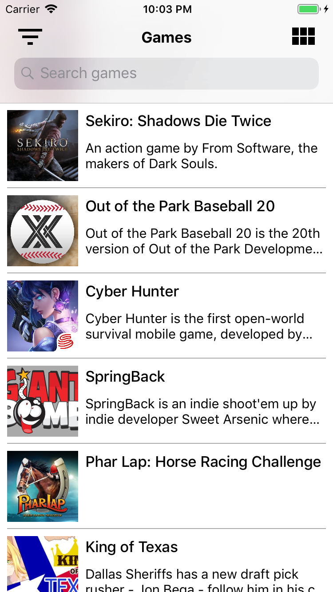
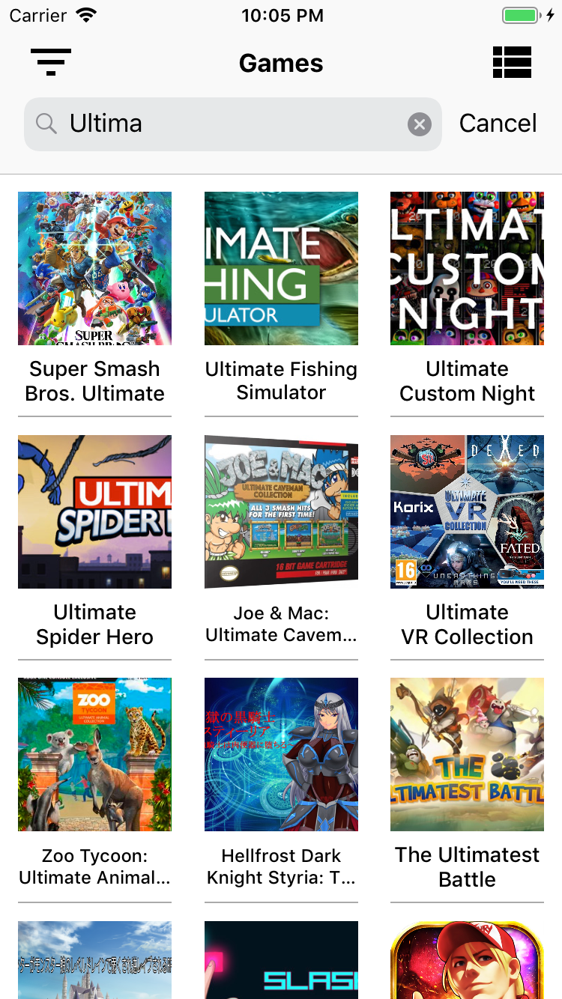
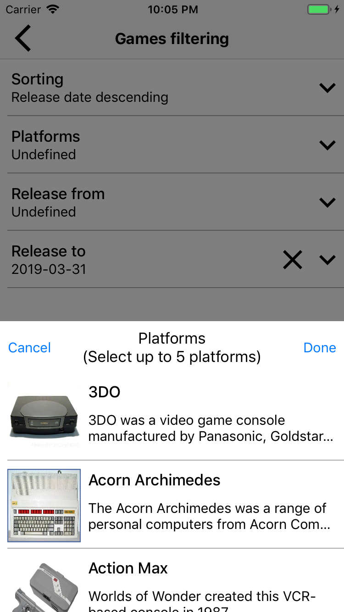
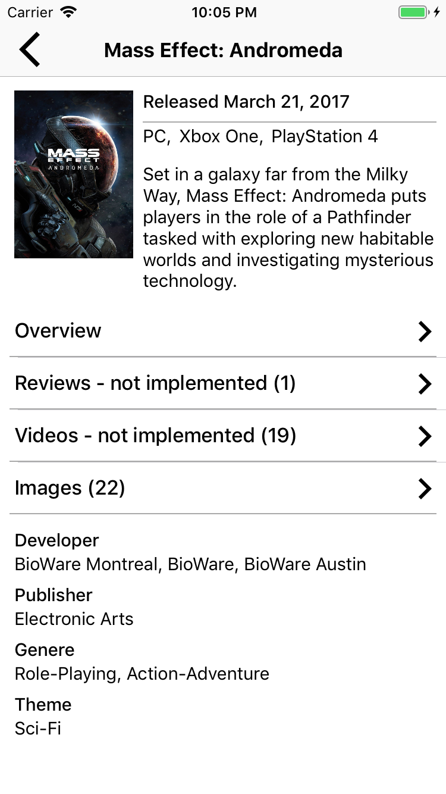

# KOMvvmSample

KOMvvmSample is a proposition of mvvm architecture, that can be used in your own project. Example is based on [GiantBomb](https://www.giantbomb.com/api) api.

## Goals

General goal is to make code readable and easy to understand without overwhelm architecture.

1. Keep style and conventions of Swift.
2. Use only the key frameworks.
3. Logical placement of files due to purpose.
4. Make logic and views separately, simplify the connections between them. But don't make the hell from interfaces connections, that makes everything hard to find.
5. Make logic easy to tests.

## Installation

1. Download all sources
2. Install all pods
3. Grab api key from here: https://www.giantbomb.com/api
4. Insert your apiKey in: 
    Application -> ApplicationSettings -> ApiSettings -> apiKey
    
## Requirements
    
* iOS 11+
* Xcode 10.0+
* Swift 4.2+
    
##  Is the Mvvm ideal? 
    
No there isn’t an ideal architecture, each of them has advantages and disadvantages, in wrong hands all of them can be a shit. Massive files or thousand files with 100 lines of code with bidirectional interface connections can be a fu***** nightmare, where you can’t find anything or it will be very hard. Searching ideal architecture is like searching the holy grail, you can’t find it 🙂 but you can try it and make your architecture better over the time. 

The main advantages of mvvm are: 

1. Logic and views are separated.
2. Views can be easily replaced. 
3. Unit tests should coverage only a logic in ViewModels.
4. Presentation behavior will be handled by RxSwift or some types of bindings. So you don’t need to create it by yourself.
    
## Architecture parts
    
1. Extensions - Extensions of common used types like UIView or String.
2. Components - Components that was used in code. Buttons, labels and different kinds of views. Creating the defaults types of views are key to create easily application themes mechanism. All default views should use theme colors and fonts from "Resources" part of architecture.
3. Services - Services used in app to do some specific actions. Each of them should has only one responsibility like: managing the data files, managing the api connections etc.
4. Scenes - Different scenes of application. Each scene should be constructed from: 
    1. Controller - Controller of scene, that makes available scene logic and some actions to the its views by protocol.
    2. ControllerProtocol - Logic and list of controller actions that can be used from views in scene.
    3. ViewModel - Separated logic of whole scene.
    4. View - Views that can use logic and some actions from the controller by protocol.
5. Resources - Theme and localizations files. Files can be assigned to the app target to create specific skin per app (white label).
6. Application - All stuff connected with the application settings or navigation over the scenes.

## FAQ

1. Why RxSwift? - RxSwifts handles all connections between data and controls on the screen. So you don’t need to create own presentation behavior. RxSwift has a lot of filtering methods and really simple sequence mechanisms with the possibility of changing threads between part of sequence. 
2. Why you don’t use SnapKit? - In this project the one of goals is to use only the keys frameworks. So I wrote a simple extension to manage constraints.
3. Why you don't generate views for controllers? - Building views manually is more flexible than by generator, because you can better separate views from each other. You aren't depending on the controls outlets. All constraints and properties are directly set in the views code in once place, so you have the better control over them. It's easier to resolve conflicts between code versions instead of xib files. Of course there are some disadvantages of this idea, it take more time to create views and if you want to have different layout on the different screens sizes you must manually change constraints depending on the traits collections instead of use size classes in xib files.

## License

This project is licensed under the MIT License - see the [LICENSE](LICENSE) file for details.
